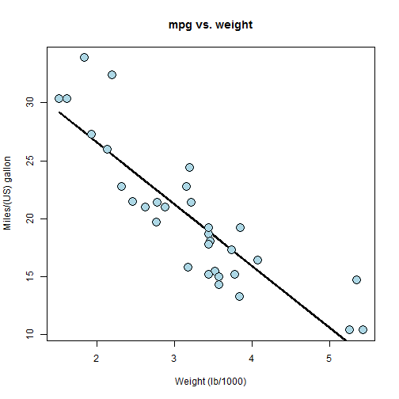
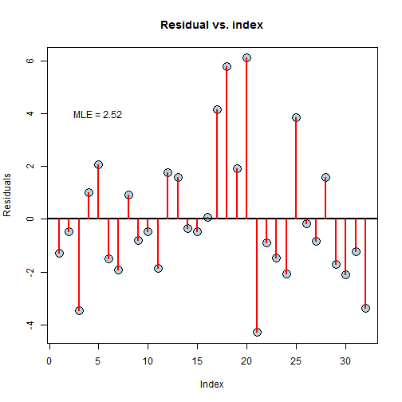

Analysis of the Motor Trend Car Road Tests
========================================================

author: Florian Ulmar

date: 10.03.2016

========================================================

The dataset **mtcars** was extracted from the 1974 Motor Trend US magazine, and comprises fuel consumption and 10 aspects of automobile design and performance for 32 automobiles.
<small>
* [, 1]	 mpg	 Miles/(US) gallon
* [, 2]	 cyl	 Number of cylinders
* [, 3]	 disp	 Displacement (cu.in.)
* [, 4]	 hp	 Gross horsepower
* [, 5]	 drat	 Rear axle ratio
* [, 6]	 wt	 Weight (lb/1000)
* [, 7]	 qsec	 1/4 mile time
* [, 8]	 vs	 V/S
* [, 9]	 am	 Transmission (0 = automatic, 1 = manual)
* [,10]	 gear	 Number of forward gears
* [,11]	 carb	 Number of carburetors
</small>

Predictors for Miles per Gallon
========================================================

p-values for the univariate univariate regression:


```
   name         pval
1    wt 1.293959e-10
2   cyl 6.112687e-10
3  disp 9.380327e-10
4    hp 1.787835e-07
5  drat 1.776240e-05
6    vs 3.415937e-05
7    am 2.850207e-04
8  carb 1.084446e-03
9  gear 5.400948e-03
10 qsec 1.708199e-02
```

***
 

A multivariate prediction model
========================================================

The best model is given by a multivariate regression of **weight** and  **Number of cylinders**.

Further variables have only a slight influence to the prediction result.

***

 


Thank you very much
========================================================

I hope that this presentation has given you some ideas of the reasons for car fuel consumption.

Please send feedback to florian.ulmar@googlemail.com

Thank you for your attention!
